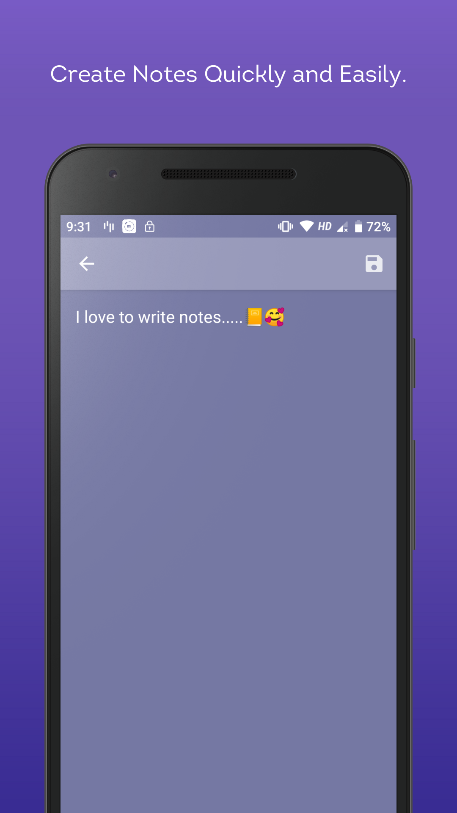
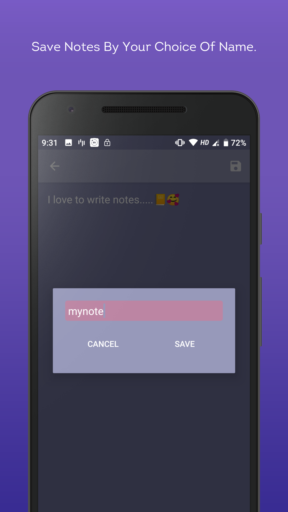
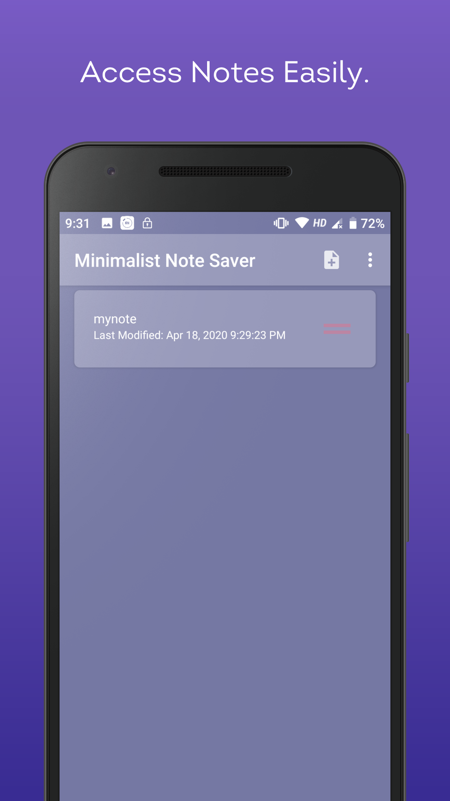
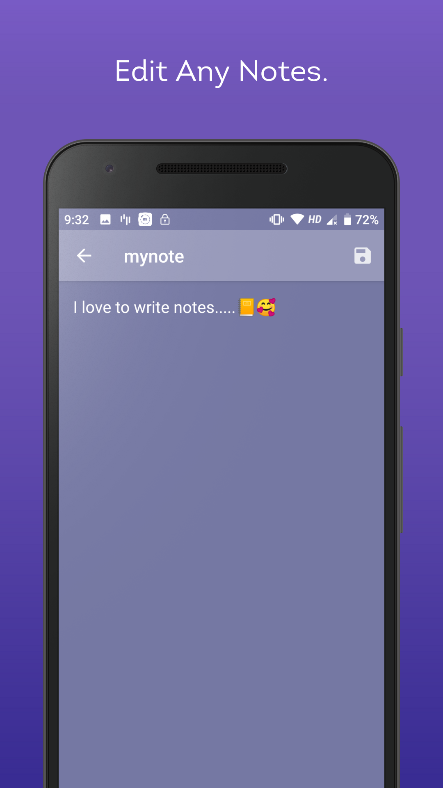
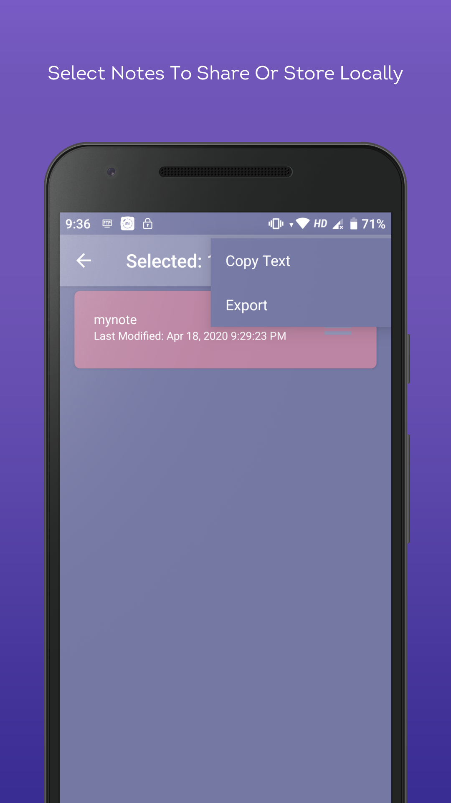
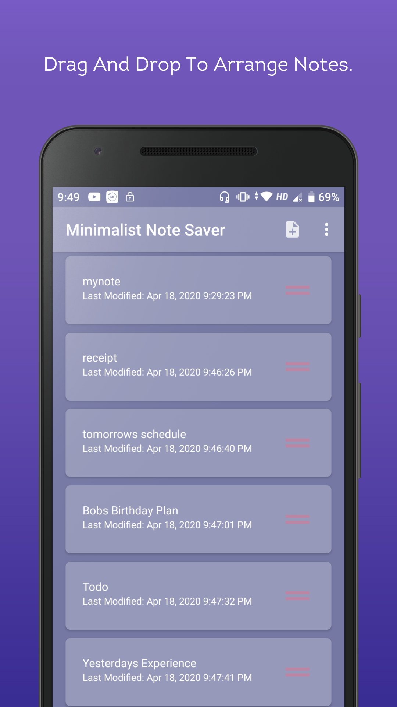

# MinimalistNoteSaver
A minimalist designed app for storing text note files with simple design and easy to use ui. 
One of my first projects so it may have contain some bad practices.

## Libraries Used
* [Advanced RecylerView][0]
* [Gson][1]
* [Dexter][2]
* [Recycler-View FastScroll][3]
* [AVLoadingIndicatorView][4]

[0]: https://github.com/h6ah4i/android-advancedrecyclerview
[1]: https://github.com/google/gson
[2]: https://github.com/Karumi/Dexter
[3]: https://github.com/timusus/RecyclerView-FastScroll
[4]: https://github.com/81813780/AVLoadingIndicatorView

## Screenshots

